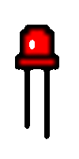

# LED Controller
A simple tutorial on how to control an LED using Dialog IoT Platform

## Get your gear
* NodeMCU
* Micro USB cable
* LED
* 330Ω resistor
* Male-female jumper wires
* Breadboard

  

### Create your developer account at https://portal.iot.ideamart.io

  * Once you have completed the registration process, Please click the email confirmation link which is sent to your registered email address & then contact one of our ideamart admins to activate your account.
  * After the approval, login to your account and follow the steps below
  
1. Create your device configuration in the developer portal
   1. Click on **Device Onboarding(json)** under **Device Management**
   1. Select **Generic_brand_xxx** under **Device Definitions**
    1. Choose MQTT from the dropdown menu under **Connection Method** & click **Save**  

    1. Click **Add Action** under **Action** create **ON** , **OFF** actions as below & then click **Save**
  

  

  

  

1. Now go to **Device Operation** under **Device Management** and click **Add Device**
 1. Enter the required parameters as follows and click **Save**
 

  

  

 1. Once sucessfully saved, your new device will be visible under the **Devices** tab as shown below 
 

  

  

### Let's modify the device firmware(Arduino Code) according to your device properties
 1. If you haven't setup the ESP8266 environment in your Arduino IDE, then follow these steps, otherwise skip & continue to **step 2**
    * Firstly open the Arduino IDE
    * Go to files and click on the preference in the Arduino IDE

    * Copy the below URL to the **Additional boards Manager URLs** & click OK to close the preference Tab *http://arduino.esp8266.com/stable/package_esp8266com_index.json*
    * After completing the above steps , go to *Tools* -> *board*, and then select *board Manager* 

    * Navigate to '**esp8266 by esp8266 community**' and install it.   
    
 1. Follow [this](https://www.youtube.com/watch?v=GUTpaY1YaXo) youtube tutorial & install the **ArduinoJson** library
 1. Similarly install **PubSubClient** library from the **Library Manager** 

 
     **Once all the above process been completed we are ready to program our NodeMCU with Arduino IDE.** :+1:

 1. Download the **LED_Controller.zip** and extract it to your preferred location
 1. Open the **.ino** file inside the folder named **LED_Controller**
 1. The code has 3 differnt parts namely **LED_controller, main, your_actions_events**. You have to modify only the **LED_Controller** to sucessfully control your **LED**
 

 1. Please change the values of **BRAND,TYPE,VERSION,MAC_ADDRESS** under **Device Details** to your device's properties [**use only lowercase letters**]
 1. Also change the **username** & **password** under **WiFi Credentials** to your own WiFi username & password (Home router/Mobile hotspot)
   *See the example below for a clear understanding:* 

  
 ## Connecting the LED to NodeMCU
 
 * Connect the anode (+ve) of the LED to 330Ω resistor on the breadboard
 * Using a jumper wire, connect the free terminal of the resistor to pin D1 of the NodeMCU
 * Finally connect the cathode (-ve) of the LED to GND (ground) of the NodCMU

### Your final circuit should look similar to the below circuit diagram 

*Now connect the NodeMCUto your PC using the USB cable and before uploading make sure you have selected the correct **COM PORT** and other settings as below* 

**After successful upload you will see 2 LED blinks to indicate that your LED is now connected to the *Dialog IoT platform* and ready to receive your commands**

You can also open the **Arduino Serial Monitor** in order to debug and check the device status

Follow these steps to execute the **ON & OFF** actions

  * Go to your developer account -> Device Operation -> Devices  & select your device
  * Select your desired action from the drop down menu under **Device Actions** & click **Execute**
  

